# Vercel Configuration for Quality Gates Integration

## How to Configure Vercel to Respect GitHub Quality Gates

### 1. **Branch Protection Setup (Critical)**

Go to GitHub repository → Settings → Branches → Add rule for `main`:

**Required Status Checks:**
- ✅ `backend-quality`
- ✅ `frontend-quality`
- ✅ `e2e-quality`
- ✅ `quality-gates-summary`

**Protection Settings:**
- ✅ Require status checks to pass before merging
- ✅ Require branches to be up to date before merging
- ✅ Include administrators (recommended for consistency)

### 2. **Vercel Git Integration Settings**

In your Vercel dashboard:

1. Go to Project Settings → Git
2. **Production Branch:** `main` only
3. **Deploy Hooks:** Disabled (use Git integration only)
4. **Auto Deploy:** Enabled for `main` branch only

### 3. **Vercel Ignored Build Step**

Create `vercel.json` configuration:

```json
{
  "version": 2,
  "github": {
    "silent": true,
    "autoAlias": false
  },
  "builds": [...],
  "routes": [...]
}
```

### 4. **Development Workflow with Quality Gates**

```mermaid
graph TD
    A[Developer pushes to main] --> B[GitHub Actions: Quality Gates Start]
    B --> C{All Quality Gates Pass?}
    C -->|YES| D[✅ GitHub marks commit as passed]
    C -->|NO| E[❌ GitHub marks commit as failed]
    D --> F[Vercel sees ✅ and deploys]
    E --> G[🚫 Vercel deployment blocked]
    F --> H[🚀 Live on Production]
    G --> I[🔧 Developer fixes issues]
    I --> A
```



## 🛡️ **Quality Gates Process**

When you push your button changes to main:

1. **Immediate Trigger:** GitHub Actions starts quality gates
2. **Backend Tests:** Must pass with 90% coverage
3. **Frontend Tests:** Must pass with 90% coverage
4. **E2E Tests:** Complete user journeys must work
5. **Code Quality:** Linting, formatting, security scans
6. **Final Check:** All gates must be ✅ green

**Only then** → Vercel deploys to production

## 🚀 **Benefits of This Approach**

- **Zero Bad Deployments:** Broken code never reaches users
- **Fast Feedback:** Know immediately if your changes break anything
- **Confidence:** Every deployment is thoroughly tested
- **Professional:** Enterprise-level development process

## 🔧 **Emergency Override (Use Sparingly)**

If you need to bypass quality gates in true emergencies:

1. Push to a `hotfix/emergency-fix` branch
2. Manually deploy via Vercel CLI: `vercel --prod`
3. Immediately create PR to fix the root issue

**Note:** This should be rare and always followed by proper fixes.
